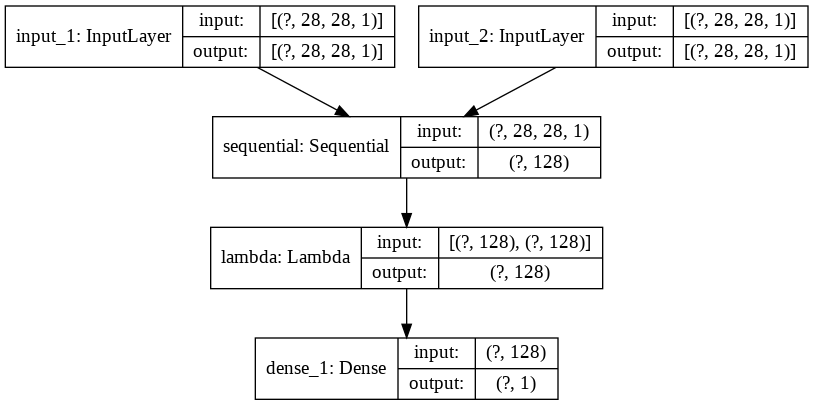
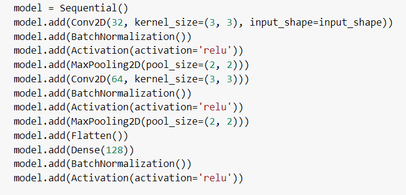
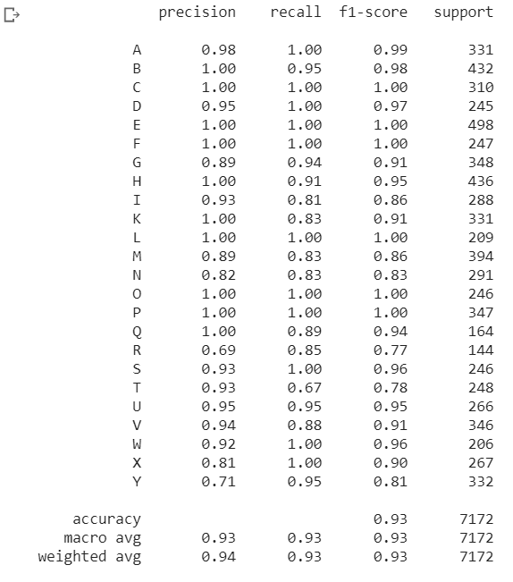

# asl-recognition-using-siamese-network

In this project I have used the dataset available at https://www.kaggle.com/datamunge/sign-language-mnist

Although this dataset can be trained using a standard CNN model, In this project I have used siamese network model to recognize american sign language.

Framework used : 

Tensorflow, Keras

ASL Dataset Example:

Model used : 

Here, Input Layer is defined as follows : 

Classification Report Generated on TestSet: 

This model is successfully able to classify static sign language image into 24 classes with 100% accuracy on test set

This is because the sign for J and Z are in motion, which i will look to cover in a future project.

